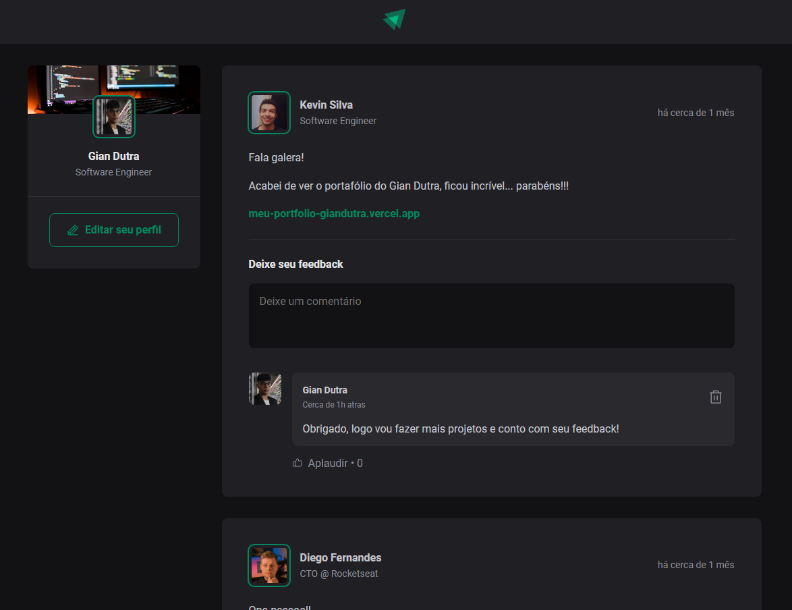

# ignite Feed

<p align="center">
  

  
 
  <a href="https://github.com/GianDutra/coffee-delivery/commits/master">
    
  </a>
  

 <a href="https://ignite-feed-type-script.vercel.app/">
    
  </a>
  
</p>

> Projeto desenvolvido durante o Curso Ignite da trilha de ReactJS.

## Linguagens e Tecnologias usadas

Para criar o site foi utilizado:

#### **Website**  ([React](https://reactjs.org/)  +  [TypeScript](https://www.typescriptlang.org/) + [Vite](https://vitejs.dev/))

- **[PhosphorIcons](https://phosphoricons.com/)**
- **[date-fns](https://date-fns.org/)**
  
## Ajustes e melhorias

- [x] Responsividade
- [x] Utilizando componentização reactJS
- [x] Criar/Deletar comentários
- [x] Substituindo JavaScript por TypeScript

## 💻 Pré-requisitos

Antes de começar, verifique se você possui instalado:

* [Node.js](https://nodejs.org/en/)
* [Git](https://git-scm.com)

## 🚀 Instalando <Ignite-Feed-TypeScript>

 
```bash

# Clone este repositório
$ git clone https://github.com/GianDutra/Ignite-Feed-TypeScript.git

# Acesse a pasta do projeto no seu terminal
$ cd Ignite-Feed-TypeScript

# Instale as dependências
$ npm install

# Rode o aplicativo no modo de desenvolvedor
$ npm run dev

# O aplicativo vai abrir por padrão na porta: 3000 - vá para http://localhost:3000/

```

---


## 👨‍💼 Autor

<table>
  <tr>
    <td align="center">
      <a href="#">
        <br>
        <sub>
          <b>Gian Dutra</b>
        </sub>
      </a>
    </td>
  </tr>
</table>
